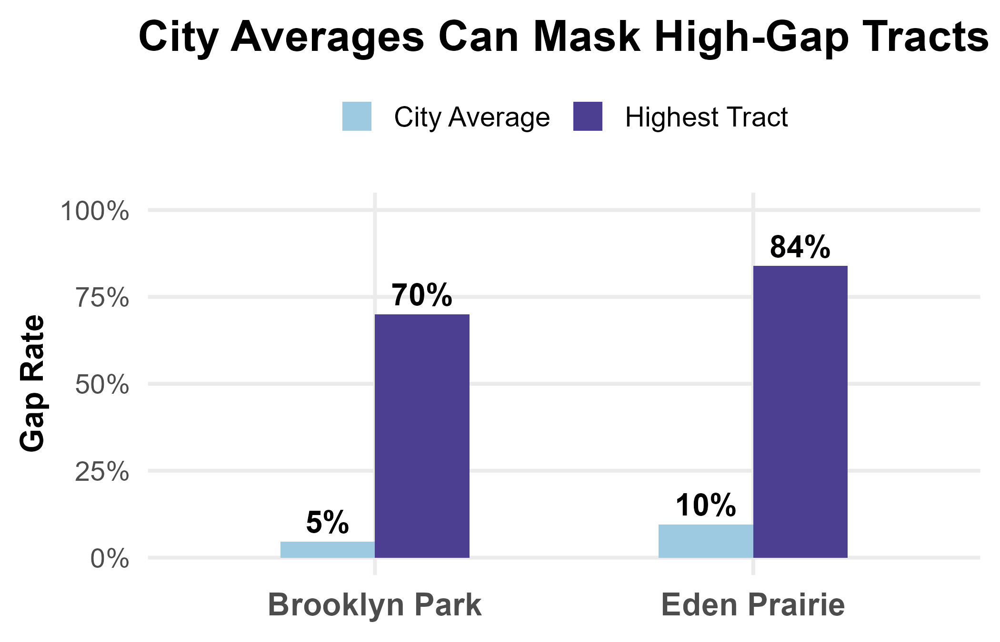
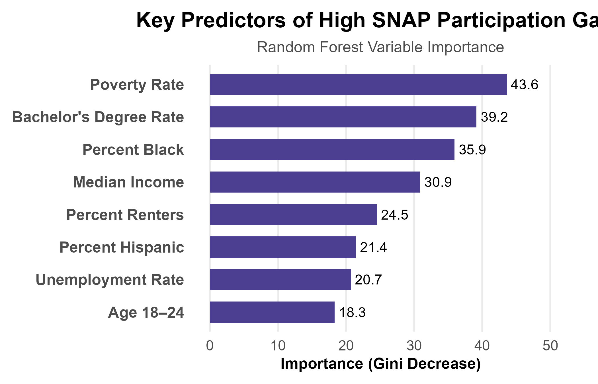

### Hennepin County SNAP/MFIP Participation Gap Analysis

Group capstone project for DST 490, by **Brandon Bloss, Ini Udomah, and Vincent Rupp**.

**[View the live interactive map →](https://vjrupp49.github.io/hennepin-county-snap-mfip-analysis/IVB_Map_1.html)** | **[Read the full report (PDF)](report/IVB_Project_Report.pdf)**

#### The question

To what extent do municipal boundaries hide hyper-local SNAP and MFIP participation hotspots, and how has the density of that unmet need changed over time across Hennepin County post-COVID, from 2020 to 2025?

City and county-level averages often suggest stable or improving benefits participation, but those aggregated numbers can mask serious disparities at the census-tract level. This project set out to find the specific tracts where eligible residents are consistently not enrolling, even when the surrounding city looks fine on paper.

#### Approach

- Built a "gap rate" metric for every census tract: (estimated eligible residents at or below 125% of the federal poverty line, minus those actually enrolled in SNAP or MFIP) divided by eligible population.
- Combined Hennepin County's SNAP/MFIP tract-level enrollment data with ACS demographic data (income, race, education, age, employment, housing).
- Trained and compared a decision tree and a random forest classifier (80/20 train/test split) to identify which tracts fall into the highest-gap category and which demographic variables predict that outcome.
- Mapped every tract's gap rate against Hennepin County and municipal boundaries to visually surface hotspots hidden inside otherwise low-gap cities.

#### Results

The random forest model reached 83.3% accuracy, 71.4% sensitivity, and 84.7% specificity identifying high-gap tracts. Poverty rate was the strongest predictor, followed by bachelor's degree attainment, percent Black population, and median income.

Several tracts near the University of Minnesota showed gap rates above 90% despite large eligible populations - for example, tract 38.02 had a 92.7% gap rate (162 enrolled out of 2,234 eligible). More broadly, cities with reassuring city-wide averages still contained individual tracts with much higher gaps: Eden Prairie's city-wide gap rate was 9.5%, but one of its tracts reached 83.9%; Brooklyn Park's city-wide rate was 4.6% against a tract as high as 70%.

The recommendation: Hennepin County should shift toward tract-level, community-based outreach rather than city-level strategy - including targeted campus outreach near the University of Minnesota and closer coordination with rural western Hennepin communities on transportation and application support.

**City-wide averages vs. individual tract gap rates:**

**What predicts a high-gap tract:**

#### Files

`report/IVB_Project_Report.pdf` - the full written report.
`scripts/IVB_Decision_Tree.R` - decision tree model.
`scripts/IVB_Map_1.R` - the tract-level gap map (also extended individually as an interactive version in the [Data Visualization Portfolio](https://github.com/vjrupp49/data-visualization-portfolio) repo).
`docs/IVB_Map_1.html` - the rendered, standalone version of that interactive map, hosted live via GitHub Pages (linked at the top of this README).
`scripts/municipality_boxplots.R` - city-level boxplot visualization of tract-level gap spread.
`data/hennepin_snap_mfip_tract_reva.csv` - the tract-level SNAP/MFIP dataset used throughout.
`images/` - key result visualizations from the analysis.

#### Tech

R (tidyverse, sf, randomForest, rpart)
      
